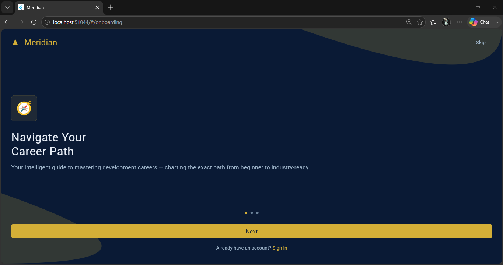
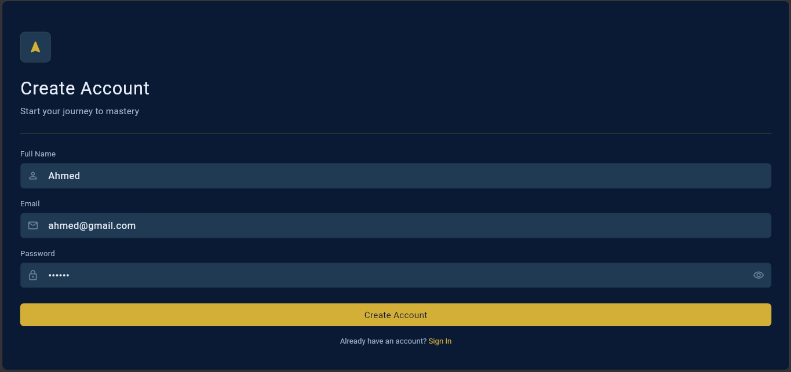
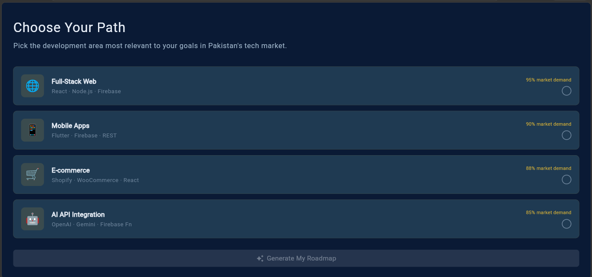
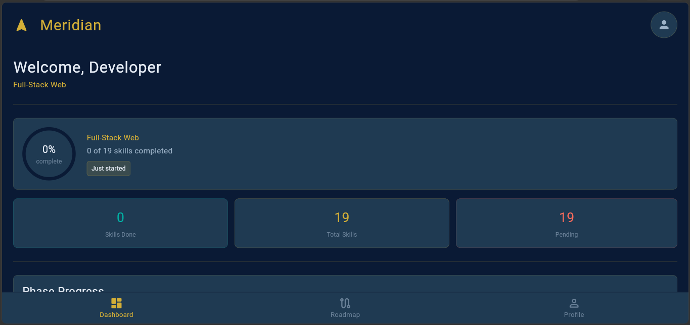
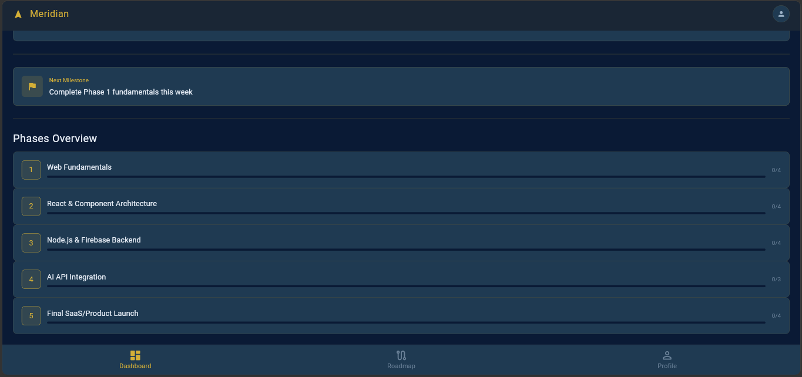
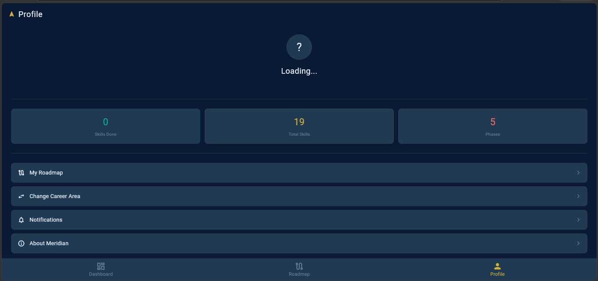

# 🚀 Meridian – AI-Powered Career Navigation App

## 📖 Overview

Meridian is a Flutter-based career guidance application that helps students and aspiring developers choose the right software development career path. The app provides personalized learning roadmaps, recommended skills, projects, and courses while allowing users to track their learning progress.

Built using **Flutter**, **Firebase Authentication**, and **Cloud Firestore**, Meridian offers a modern and interactive learning experience for students preparing for careers in technology.

---

## ✨ Features

- 🔐 Secure user authentication with Firebase
- 🎯 Career path selection
- 🗺️ Personalized learning roadmaps
- 📚 Skill, project, and course recommendations
- ✅ Progress tracking
- 📊 Learning dashboard
- 👤 User profile management
- ☁️ Cloud Firestore integration

---

## 🛠️ Tech Stack

- Flutter
- Dart
- Firebase Authentication
- Cloud Firestore
- Material Design

---

# 📱 Screenshots

## 🔑 Login Screen

Secure login using Firebase Authentication.

---

## 📝 Register Screen

Create a new account to start your learning journey.

---

## 🎯 Career Selection

Choose your preferred development career path including Flutter, Web Development, AI, SaaS, and E-Commerce.

---

## 🗺️ Learning Roadmap

Receive a structured roadmap containing learning phases, required skills, recommended projects, and learning resources.

---

## 📊 Progress Dashboard

Track completed skills and monitor your overall learning progress.

---

## 👤 Profile

View your profile information and selected career path.

---

## 🚀 How It Works

1. Register or log in.
2. Select your preferred development field.
3. Receive a personalized learning roadmap.
4. Complete skills and learning milestones.
5. Track your overall progress.
6. Continue learning with recommended resources and projects.

---

## 🔮 Future Improvements

- AI-powered personalized recommendations
- Achievement badges
- Dark mode
- Learning reminders
- Community discussion forum
- Advanced analytics

---

## 👨‍💻 Author

**Ahmed Hassan**

BS Computer Science  
Air University

---

⭐ If you found this project interesting, consider giving it a star.
